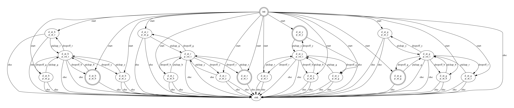

1. [Theory behind the project](#theory-behind-the-project)

    - [Reinforcement Learning](#reinforcement-learning)
    - [Taxi-v3](#taxi-v3)
    - [Temporal Goals](#temporal-goals)
    - [Reward Shaping](#reward-shaping)
    - [Restraining Bolts](#restraining-bolts)
    - [Automata as Reward Shaping](#automata-as-reward-shaping)
    - [Temporal Logic](#temporal-logic)
    - [LTL$$ _f$$](#ltl$$-_f$$ )
    - [DFA](#dfa)
    - [STRIPS](#strips)

2. [Our experiments](#our-experiments)
3. [Results](#results)

    - [Base environment goal](#base-environment-goal)
    - [Pass through center goal](#pass-through-center-goal)
    - [Pass through 1 corner goal](#pass-through-1-corner-goal)
    - [Pass through 2 corners goal](#pass-through-2-corners-goal)
    - [Pass through 3 corners goal](#pass-through-3-corners-goal)
    - [Pass through 4 corners goal](#pass-through-4-corners-goal)
    - [STRIPS-based TG](#strips-based-tg)

# Theory behind the project

### Reinforcement Learning
Reinforcement Learning (RL) is a branch of Machine Learning (ML), one of the most prominent and established field of study in the Artificial Intelligence (AI) sector. 

AI algorithms that belong to this sub-class are designed to improve their capabilities of performing some task with experience: <em>learning </em>.
In general, RL aims at learning an optimal behavior function, called <em>policy</em>, $$ \pi : S \rightarrow A$$ , given a set of states, actions and rewards, $$ D = \{(\langle s_0, a_1, r_1, s_1, ..., a_n, r_n, s_n\rangle_i)^n_{i=1}\}$$, in order to maximize the final cumulative reward provided by a reward function.

A reinforcement learning problem may be modeled as a Markov Decision Process (MDP).

A MDP model can be defined as:

$$ MDP= \langle S, A, \delta, r \rangle$$ 
with:
-  $$ S$$  is a finite set of states, they may be fully or partially observable
-  $$ A$$  is a finite set of actions
-  $$ \delta$$  is a transition function, it may be deterministic, non-deterministic or stochastic
-  $$ r: S \times A \times S \rightarrow \mathbb{R}$$  is a reward function

#### Taxi-v3
Taxi-v3 is one among all the proposed tasks in the set of environments provided by [OpenAI](https://openai.com/), a prominent AI research and deployment company that offers a powerful toolkit, named [Gym](https://gym.openai.com/), for developing and testing reinforcement learning algorithms. This library consists in a collection of different challenges, called <em>environments</em>, which covers all the main known problems and weaknesses that afflicted, or still afflict, the RL field of study.

The task, inspired by the taxi driver job, is relatively simple and takes place in a $$ 5 \times 5$$  grid with 4 marked tiles called <em>R, G, Y, B</em>.
At each round, called <em>episode</em>, two of these positions are randomly chosen as passenger and destination locations, while another random one is picked along the whole grid as taxi's starting location. The goal of the agent is to bring the passenger to the destination, trying to maximize the final total reward. In case of coincidence of passenger and destination tiles, the agent still has to pick up the passenger and drop him off in place.
To accomplish this objective, the driver can freely move inside the grid in any orthogonal direction with the exception of trespassing the outer edges or some fixed walls between tiles.

The environment is represented at each time step by its state: considering all the possibilities made by 25 taxi positions, 5 passenger positions, <em>on taxi</em> included, and 4 destinations, there are in total 500 states that are indexed with an encoding of discrete values in the interval $$ [0, 499]$$ .

The state is updated only by the agent's actions. There are 6 possible actions the agent can perform at any step of the episode, which are:

-  <em>Move South</em>,
-  <em>Move North</em>,
-  <em>Move East</em>,
-  <em>Move West</em>,
-  <em>Pick up</em> the passenger and
-  <em>Drop off</em> the passenger.

In order to train the agent, a $$ -1$$  per-step reward is applied, except for the <em>Pick up</em> and <em>Drop off</em> actions which, if done illegally, costs $$ -10$$ . The episode ends if the agent performs the maximum number of fixed steps or if it manages to drop off the passenger at the destination obtaining a $$ +20$$  reward.

#### Temporal Goals
We now explore Goal-Directed Exploration with a Reinforcement Learning Algorithm. This means that an agent has to learn a policy to reach a goal state in an initially unknown state space. Once the reinforcement learning problem reaches the goal state the agent has to find some path to a goal state in an initially unknown (or partially known) state space with no need to find the shortest path. 
The idea is using a set of temporal goals in order to reach the final goal. It is possible to consider a set of temporal goals expressed in LTL$$ _f$$  notation.

##### Reward Shaping
Reward shaping is a method for engineering a reward function in order to provide more frequent feedback on appropriate behaviors.
The reward shaping in RL consist of supplying additional rewards to a learning agent to guide its learning process more efficiently, helping it in achieving the optimal policy faster. The reward shaping  function can be integrated in the MDP, $$ M=(S, A, T, \gamma, R)$$ , modifying its reward function, $$ R$$ , as $$ R' = R + F $$  where $$ F: S \times A \times S \Rightarrow \mathbb{R}$$  is a bounded real-valued function. Then  if the original MDP would have received a reward $$ R(s,a,s')$$  for transitioning from $$ s$$  to $$ s'$$  on an action $$ a$$  then in the new MDP it would receive the following reward:
$$  R'(s,a,s')=R(s,a,s')+F(s,a,s') $$ 
This process will encourage the learner to take the action $$ a$$  in some set of states $$ S_0$$  leading faster to the optimal solution.

#### Restraining Bolts
A restraining bolt is a device that restricts an agent’s actions when connected to its system. The restraining bolt has the aim of limiting actions to a set of desired behaviors. The restraining bolt gives an additional representation of the world with respect to the one that the agent already has. The agent has to conform as much as possible to the restraining specifications.
The link between the two representation is given by studying this problem in the Reinforcement Learning scope.

In a RL task with restraining bolt:
    
-  The learning agent is modeled by the MDP: $$ M_{ag} = \langle S, A, T_{r_{ag}}, R_{ag} \rangle$$ 
-  The restraining bolt is modeled as $$ RB = \langle L,\;\{(\phi_i,\; r_i)\}^m_{i=1} \rangle$$ , where $$ L$$  is the set of possible fluents and the set is the restraining specifications represented in LTL$$ _f$$  formulas.

#### Automata as Reward Shaping
A Reward Machine indicates what reward function should be used to obtain a reward signal given the states label that the agent met up until now. 
The idea is to approximate the cumulative discounted reward in any RM state by treating the RM itself as an MDP. The value iteration would be the maximum value of the optimal policy. 

### Temporal Logic
Temporal Logic (TL) is a logic language that offers some time-related rules and operators to deal with propositions in which truth varies with time. Its complex syntax involves the introduction, along with the classical connectives $$ \neg, \land, \lor$$ , of two shared operators:

-  The <em>Necessarily</em> operator, $$ \square \varphi$$ : states that $$ \varphi$$  is true in all the possible worlds,
-  The <em>Possibly</em> operator, $$ \diamond \varphi$$ : states that $$ \varphi$$  is true or will be true in all the possible worlds.

This semantic representation allows also simple graphical representations based on graphs.

#### LTL$$ _f$$ 
Linear Temporal Logic (LTL) is an extention of TL which is characterized by the formulation of a wider set of operators:

-  The <em>Globally</em> operator, $$ G \varphi$$ : like $$ \square \varphi$$  states that $$ y$$  is true now and in all the future time points,
-  The <em>Finally</em> operator, $$ F \varphi$$ : like $$ \diamond \varphi$$  states that $$ y$$  is true now or it will at some time point in the future,
-  The <em>Next</em> operator, $$ X \varphi$$  or $$  \circ \varphi$$ : states that $$ \varphi$$  will be true in the next time point,
-  The <em>Until</em> operator, $$ \varphi_1$$  $$ \cal U$$  $$ \varphi_2$$ : states that $$ \varphi_1$$  is true until $$ \varphi_2$$  is true.

Finally, the complete description of evolution over time, consisting in a sequence of propositional interpretations, one for each time point, is called <em>trace</em> and a formula's truth is evaluated over that trace.
For the standard LTL semantics, traces are infinite.

#### DFA
A Deterministic Finite Automaton (DFA) is an abstract representation shaped as a finite state machine that takes a string of symbols as input and, running through a sequence of states, may accept or reject it.

More in depth, a DFA is defined as:

$$  {\cal DFA} = (\Sigma, S, s^0, \rho, F)$$ 

with:
-  $$ \Sigma$$ : a finite and non-empty <em>alphabet</em>, where a <em>word</em> is an element of $$ \Sigma^\ast$$  (i.e. a finite sequence of symbols $$ a_0 ... a_n, a_i \in \Sigma$$ ),
-  $$ S$$ : a finite and non-empty set of <em>states</em>,
-  $$ s^0 \in S$$ : the <em>initial</em> state,
-  $$ F \subseteq S$$ : the set of <em>accepting states</em>,
-  $$ \rho: S \times \Sigma \rightarrow S$$ : a <em>transition function</em>.

### STRIPS
The STanford Research Institute Problem Solver (STRIPS) is a problem solver that aims to find the optimal composition of operators that transforms a given initial world model/state into one that satisfies some stated goal condition, if reachable. The operators are the basic elements from which a solution is built. The problem space for STRIPS is defined by a quadruple
$$ \Pi = \langle P, O, I, G  \rangle$$ 
where: 

-  $$ P$$  is the set of conditions,
-  $$ O$$  is the finite set of available operators and their effects on world models,
-  $$ I \subseteq P$$  the initial world model,
-  $$ G \subseteq P$$  is the goal statement.

The optimal path $$ \pi_{opt}$$  that can be obtained is the path with the lowest possible cost. The cost is defined as $$ c(x_t,u_t)$$ , where $$ x_t$$  and $$ u_t$$  are the Markovian system state and action at the time step $$ t \in [1, T]$$ , respectively. This means that there exists neither path nor plan $$ \pi'$$  such that $$ c(\pi') < c(\pi_{opt})$$ .

It is possible to translate the STRIPS domain into an equivalent LTL$$ _f$$  formula. 

Once we have expressed the STRIPS domain in a LTL$$ _f$$  formula, it is possible to convert such formula in DFA to obtain the corresponding automaton.

# Our experiments
We decided to test two categories of experiments:
1.  Translation of non-trivial LTLf formulae to a DFA Automaton to use as reward machine in a RL task
2.  Translation of a complete STRIPS description of an environment to a DFA Automaton to use as reward machine in a RL taks

In the first category we tested the following formulae, ordered by increasing complexity:

-  Base environment goal: $$  a\; \mathrm{U}\; (b\; \mathrm{U}\; c) $$ . In this goal we check first that there is a taxi anywhere in the map ($$ a$$ ), then that the passenger is picked up by the taxi ($$ b$$ ) and finally that the destination is reached ($$ c$$ ). Note that this is the equivalent goal of the environment, which we used as baseline to ensure the correctness of our solution.
-  Pass through center: $$  a\; \mathrm{U}\; (b\; \mathrm{U}\; (c\; \mathrm{U}\; d)) $$ . In this goal first that there is a taxi anywhere in the map ($$ a$$ ), then that the passenger is picked up by the taxi ($$ b$$ ), that the taxi passes through the center of the map ($$ c$$ ) and finally that the destination is reached ($$ d$$ ).
-  Pass through 1 corner: $$  a\; \mathrm{U}\; (b\; \mathrm{U}\; (c\; \mathrm{U}\; d)) $$ . This goal is similar to the previous one, but instead of checking if the taxi passes through the center, we check that it passes through the $$ Red$$  corner before reaching the destination.
-  Pass through 2 corners: $$  a\; \mathrm{U}\; (b\; \mathrm{U}\; (c\; \mathrm{U}\; (d\; \mathrm{U}\; e))) $$ . This goal is similar to the previous one, but we check that it passes through $$ Green$$  corner after the $$ Red$$  one before reaching the destination.
-  Pass through 3 corners: $$  a\; \mathrm{U}\; (b\; \mathrm{U}\; (c\; \mathrm{U}\; (d\; \mathrm{U}\; (e\; \mathrm{U}\; f)))) $$ . This goal is similar to the previous one, but we check that it passes through $$ Yellow$$  corner after the $$ Green$$  one before reaching the destination.
-  Pass through 4 corners: $$  a\; \mathrm{U}\; (b\; \mathrm{U}\; (c\; \mathrm{U}\; (d\; \mathrm{U}\; (e\; \mathrm{U}\; (f\; \mathrm{U}\; g))))) $$ . This goal is similar to the previous one, but we check that it passes through $$ Blue$$  corner after the $$ Yellow$$  one before reaching the destination.

For all of these, the training process ran for 2500 steps on consumer level hardware.

For the second category, we defined the STRIPS-equivalent problem. This was then used to generate the LTL$$ _f$$  formula that would, in turn, generate the DFA automaton we needed as temporal goal. As a test, we implemented only the base environment in STRIPS, so the environment goal and the temporal goal coincided. Using STRIPS formalism makes it easier to define even more complex temporal goals and it is able to encapsulate a much broader variety of goals. In our case, the definition of the base environment goal actually generated a DFA that represented \emph{all} possible environment runs (since, as we explained earlier, the environment is randomly initialized).

We developed the experiments using Python 3.7. We employed the following libraries during our development:

-  NumPy for mathematical computations,
-  Logaut defines most of the temporal logic paradigm we used,
-  Lydia is used as a backend during the LTL$$ _f$$  to DFA translation and
-  [TempRL](https://github.com/whitemech/temprl/) offers a high-level API for temporal goal (TG) based reinforcement learning.

When exploring the effects of reward shaping on different TG tasks, we used TempRL to wrap the base Gym environment in a TG-oriented environment that contained the DFA automaton of the task expressed in LTL$$ _f$$  logic. With such an environment it was possible to compute both observations for the agent and rewards that reflected not only the base environment but the DFA as well. In particular, we have that

-  The observations are tuple of $$ (env_{state},\; DFA_{state})$$ .
-  The reward is either $$ env_{reward} + DFA_{reward}$$  when reward shaping is applied of just $$ env_{reward}$$  for all transitions that do not result in a goal state to be reached, otherwise $$ env_{reward} + DFA_{task\; reward}$$ .

When testing the STRIPS formalism to define the temporal goals, we first defined the STRIPS problem. We then converted it into an LTL$$ _f$$  formula, making sure that
1.  we defined a <code>start</code> fluent that is True in the initialization and is False when the goal is reached,
2.  all negated fluents are computed for any possible initial condition, as we noticed that leaving them as <em>don't care</em> resulted in an explosion of possible DFA states, and
3.  all traces end in a <code>sink</code> state after the goal is satisfied, otherwise there could be duplicated states that differ only in whether the goal has been reached or not.
Since the states in the DFA generated in this way had no loops over themselves, we introduced an object in the TempRL library that would control whether or not to apply a step on the DFA. 

For both experiments, the agent itself was trained via tabular Q-Learning.

We provide the code for our solution at <https://github.com/gallorob/ra_project>.

# Results
We report here the results of our experiments. Each experiment consists in training the agent on the assigned LTL$$ _f$$  formula and checking if reward shaping has a significant impact on performances. For each experiment we tracked the episodic rewards during both training and testing.

### Base environment goal
We found that the agent reliably clears the environment, obtaining the temporal goal reward consistently during training and during testing, where the episodic reward is higher than the temporal goal reward (set at 100) and varies only on the number of steps taken by the agent.

 
<figcaption aligh="center">Fig.1: Train and test rewards for the base environment goal</figcaption>

When reward shaping is applied, we can see that the agent converges more rapidly to a stable high reward during training, though it also increases the frequency of failed episodes. During testing, however, the learned Q values are good enough that no episode failed. 

 
<figcaption aligh="center">Fig.2: Train and test rewards for the base environment goal with reward shaping</figcaption>

### Pass through center goal
This modified temporal goal is still easily solved by the agent during training and testing.

 
<figcaption aligh="center">Fig.3: Train and test rewards for the passing through the center goal</figcaption>

Interestingly, however, the addition of the reward shaping effect actually hinders performances: the training is still solved but the average episodic reward is much lower and some of the tests episode actually fail. 

 
<figcaption aligh="center">Fig.4: Train and test rewards for the passing through the center goal with reward shaping</figcaption>

As the episodic rewards curve plateaus during training, we do not believe additional training steps would improve the agent's performances.

### Pass through 1 corner goal 
This modified temporal goal is similar to the previous one and as such is still easily solved by the agent during training and testing.

 
<figcaption aligh="center">Fig.5: Train and test rewards for the passing through 1 corner goal</figcaption>

Similarly to the previous goal, the addition of the reward shaping effect actually hinders performances: the training is still solved but the average episodic reward is much lower and some of the tests episode actually fail.

 
<figcaption aligh="center">Fig.6: Train and test rewards for the passing through 1 corner goal with reward shaping</figcaption>

The episodic rewards curve plateaus during training so we do not believe additional training steps would improve the agent's performances.

### Pass through 2 corners goal
This modified temporal goal is more complex than the previous one but the agent is still able to obtain high rewards during training and testing. 

 
<figcaption aligh="center">Fig.7: Train and test rewards for the passing through 2 corners goal</figcaption>

We note however that some of the tests fail or have a final rewards that consists only on the base environment's reward (ie: it does not solve the temporal goal).

The addition of the reward shaping leads to faster convergence during training but some of the tests still fail. 

 
<figcaption aligh="center">Fig.8: Train and test rewards for the passing through 2 corners goal with reward shaping</figcaption>

However, with reward shaping there is no episode in the test that is completed without achieving the temporal goal as well.

### Pass through 3 corners goal
This modified temporal goal is more complex than the previous one but the agent is still able to obtain high rewards during training and testing. 

 
<figcaption aligh="center">Fig.9: Train and test rewards for the passing through 3 corners goal</figcaption>

It is important to note that the convergence during training is much slower and the testing episodes either fail, are solved without satisfying the temporal goal and very few solve both the environment and the temporal goal. While the training curve plateaus, it is unclear if more training steps would actually increase performances significantly.

The addition of the reward shaping leads to faster convergence during training but some of the tests still fail. 

 
<figcaption aligh="center">Fig.10: Train and test rewards for the passing through 3 corners goal with reward shaping</figcaption>

However, with reward shaping there is no episode in the test that is completed without achieving the temporal goal as well.

### Pass through 4 corners goal
The last temporal goal we tested is the most complex out of all and the agent is able to only solve the base environment and not the temporal goal as well.

 
<figcaption aligh="center">Fig.11: Train and test rewards for the passing through 4 corners goal</figcaption>

The addition of the reward shaping leads to faster convergence during training but no solution is found: not even the base environment is solved. This may be due to the complexity of the temporal goal, though it is unclear why not even the base environment could be solved. 

 
<figcaption aligh="center">Fig.12: Train and test rewards for the passing through 4 corners goal with reward shaping</figcaption>

We also tried running the training with reward shaping for much longer, though the outcome is still the same.

 
<figcaption aligh="center">Fig.13: Train and test rewards for the passing through 4 corners goal with reward shaping and with more training steps</figcaption>

### STRIPS-based TG
We report the generated graph of the STRIPS problem.

<figcaption aligh="center">Fig.14: The complete Taxi environment described as a STRIPS problem</figcaption>

We ran the training for just 1500 steps as it rapidly converged to a solution.

 
<figcaption aligh="center">Fig.15: Train and test rewards for the STRIPS-defined temporal goal</figcaption>

The rewards graph is very similar to that of the base environment goal with reward shaping, reported in Fig 15. The agent learned a good policy that solved both the base environment goal and the temporal goal (though, as previously stated, these two coincide) and obtained a high-enough score in the test phase.
